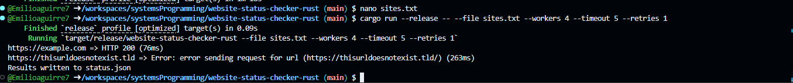

# Website Status Checker (Rust)

A concurrent website-monitoring CLI tool written in Rust. This tool checks the availability of websites using a fixed thread pool and outputs live results to the terminal and a final report to `status.json`.

---

##  Build Instructions

Ensure you have Rust (1.78 or later) installed. Then:

```bash
cargo build --release
```

---

##  Usage

```bash
website-status-checker-rust [--file sites.txt] [URL ...] [--workers N] [--timeout S] [--retries N]
```

### Examples:

1. **Using a file:**
```bash
cargo run --release -- --file sites.txt --workers 4 --timeout 5 --retries 1
```

2. **Using direct URLs:**
```bash
cargo run --release -- https://example.com https://fake.invalid --retries 2
```

If neither `--file` nor positional URLs are supplied, the tool will print a helpful usage message and exit with code 2.

---

##  Output

- Live results printed line-by-line to the terminal:
  - HTTP status code or error
  - Response time in milliseconds
- Final results are saved to `status.json`, containing an array of objects:

```json
[
  {
    "url": "https://example.com",
    "status": 200,
    "response_time_ms": 76,
    "timestamp": "..."
  },
  {
    "url": "https://thisurldoesnotexist.tld",
    "status": "error: ...",
    "response_time_ms": 263,
    "timestamp": "..."
  }
]
```

---

##  Dependencies

Only the following crates are used:
- `reqwest` (blocking HTTP client)
- `serde` and `serde_json` (for JSON output)
- `num_cpus` (to determine default thread pool size)

---

##  Features Implemented
- Fixed thread pool with concurrency
- Per-request timeout
- Retry logic on failure
- Live and batch output
- File and direct URL support

---

##  Screenshot


---

##  Example `sites.txt`
```
https://example.com
https://thisurldoesnotexist.tld
```

---


